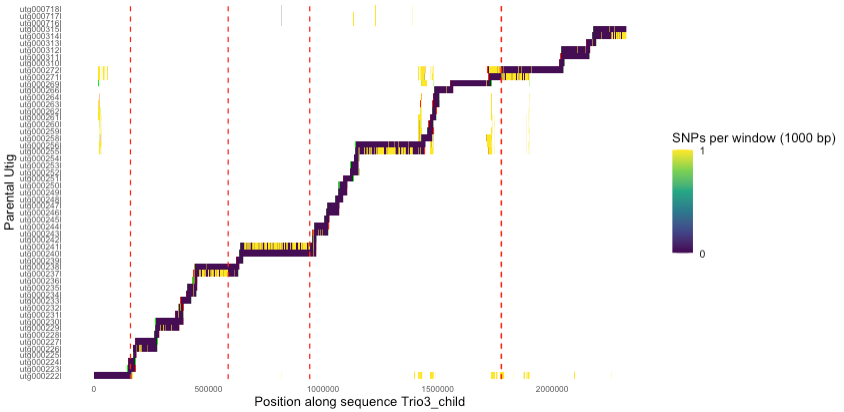

# crosshair

This repository contains code used in **Höps et al. (2026)** to detect
and visualize *de novo* structural breakpoints using a high-confidence
child assembly and lower-confidence parental assemblies.

`crosshair` identifies likely breakpoint positions by detecting
transitions in mapping quality of parental unitigs along a child
assembly.

------------------------------------------------------------------------

## Concept

We use the **child assembly as reference space** and align chopped
parental unitigs to it (which are less prone to assembly/phasing errors than the full contigs). Parental unitigs are split into fixed-size chunks (typically 1
kbp) before alignment.

If a breakpoint occurred, one part of a parental unitig maps well, another part maps poorly - Producing a clear transition in mapping
quality within the same unitig. At the same position, the correct child mapping typically "jumps" to
another parental unitig. An example visualization is shown below (red lines indicate automatically inferred breakpoint candidates - of which the last one is the correct one).




------------------------------------------------------------------------

## Workflow

### 1. Generate PAF alignments

``` bash
./scripts/align_parent_to_child.sh child_assembly_singlecontig.fasta parental_putigs_multifasta.fasta hunklen[1000] hild_position[all] > parent_utigs_to_child_ctg.paf
```

This splits parental unitigs into chunks and aligns them to the child
assembly, producing a `.paf` file.

### 2. Run the R script

In the R script, set:

``` r
paf_file  <- "parent_utigs_to_child_ctg.paf"
seqname_x <- "child_sequence_name"
```

Then run the script interactively.

-   Filters alignments based on mismatch thresholds.
-   Visualizes mapping quality along parental unitigs.

------------------------------------------------------------------------

## Example Data 

Find an example .paf file (some HG002 contigs aligned to hg38) in test-data. The Rscript plot_parent_to_child is preconfigured to run this test case. This will recreate the plot in test-data/toy-output.pdf 

------------------------------------------------------------------------

## Breakpoint Detection

The R scrit optionally detects breakpoints automatically. Detection is performed via simple edge detection: the mapping score vector is convolved with a step-function kernel (000...111), and strong transitions are reported as candidate breakpoints (shown as red dashed lines in the plot). This provides an initial proxy for likely breakpoint positions that can then be manually reviewed. Usually there are a couple of false-positives; so the auto-inferred breakpoints should really only be considered as starting points.

------------------------------------------------------------------------

## Coordinate Extraction

Once you are happy with a breakpoint (e.g. the fourth one in the example plot), you can extract its coordinates in child and parental unitig coordinates using the flank-extraction functionalities at the end of plot_parent_to_child.

------------------------------------------------------------------------

## Scope

This repository primarily documents and reproduces the breakpoint analyses performed in Höps et al. (2026). It is intended mostly as a documentation of our analysis. If you still want to use it please give it a try, and let me know if you need help. I personally find the visualization very useful.

------------------------------------------------------------------------

## License

See `LICENSE` for details.

-----------------------------------------------------------------------

## Contact

wolfram.hops@radboudumc.nl

## Citation

bioRxiv link to be added soon

